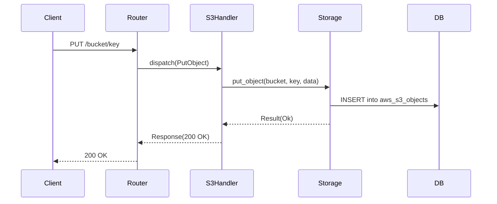

# AWS Dataflow

## WHAT
Traces the flow of data for a typical AWS request (e.g., `PutObject`).

## WHY
Understanding the request lifecycle helps in debugging and performance optimization.

## HOW

### Request Lifecycle
1. **Ingress**: Request arrives at port 4566.
2. **Parsing**: `aws-control-core` determines the service (S3) and operation (PutObject).
3. **Validation**: Checks bucket existence.
4. **Storage**:
   - Metadata (Key, Size, ETag) -> SQLite `aws_s3_objects` table.
   - Content -> Filesystem `.cloudemu/aws/s3/<bucket>/<key>`.
5. **Response**: Returns logic success (200 OK) + ETag.

### Diagram

