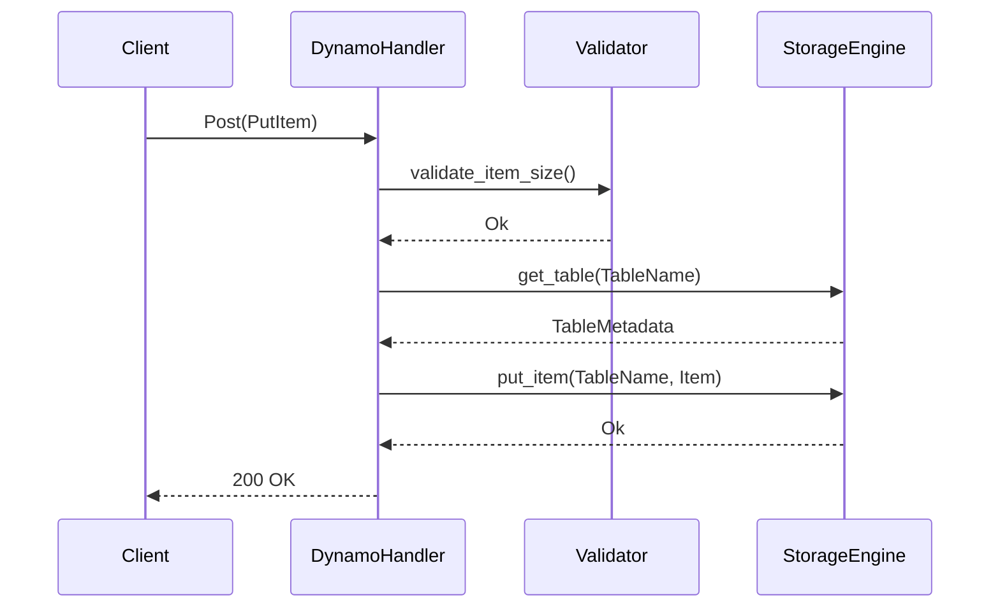

# AWS Sequence Diagrams

## WHAT
Detailed sequence diagrams for complex AWS operations.

## WHY
Visualizes the interaction between internal components.

## HOW

### DynamoDB `PutItem`

```mermaid
sequenceDiagram
    participant Client
    participant DynamoHandler
    participant Validator
    participant StorageEngine

    Client->>DynamoHandler: Post(PutItem)
    DynamoHandler->>Validator: validate_item_size()
    Validator-->>DynamoHandler: Ok
    DynamoHandler->>StorageEngine: get_table(TableName)
    StorageEngine-->>DynamoHandler: TableMetadata
    DynamoHandler->>StorageEngine: put_item(TableName, Item)
    StorageEngine-->>DynamoHandler: Ok
    DynamoHandler-->>Client: 200 OK
```
