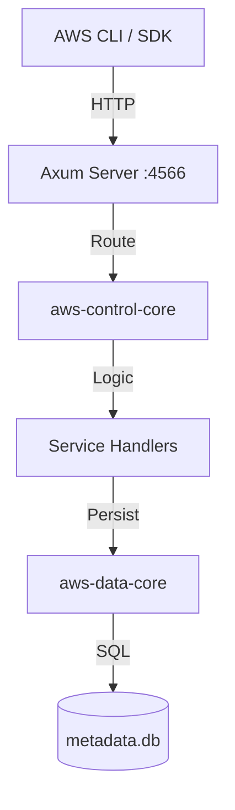

# AWS Module Architecture

## WHAT
Description of the AWS emulator architecture, following the Facade pattern.

## WHY
Modular design allows independent evolution of AWS service emulation logic while sharing the underlying Storage Engine.

## HOW

### Components
1. **Control Plane** (`aws-control-core`): Parses AWS Wire Protocol (JSON/XML), validates signatures (stubbed), and routes requests.
2. **Data Plane** (`aws-data-core`): Implements the `StorageEngine` trait to persist S3 buckets, DynamoDB tables, etc. into SQLite.
3. **Facade** (`aws-control-facade`): Exposes the Axum router.

### Layered View

