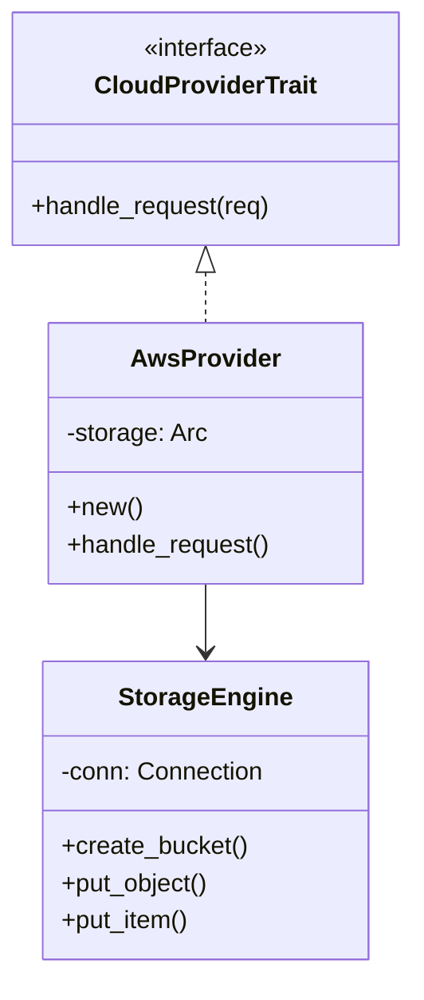

# AWS Class Diagrams

## WHAT
Structure of the Rust structs and traits for the AWS module.

## WHY
Helps developers understand the code structure and relationships.

## HOW

### Core Structures

```mermaid
classDiagram
    class CloudProviderTrait {
        <<interface>>
        +handle_request(req)
    }
    class AwsProvider {
        -storage: Arc<StorageEngine>
        +new()
        +handle_request()
    }
    class StorageEngine {
        -conn: Connection
        +create_bucket()
        +put_object()
        +put_item()
    }
    
    CloudProviderTrait <|.. AwsProvider
    AwsProvider --> StorageEngine
```
