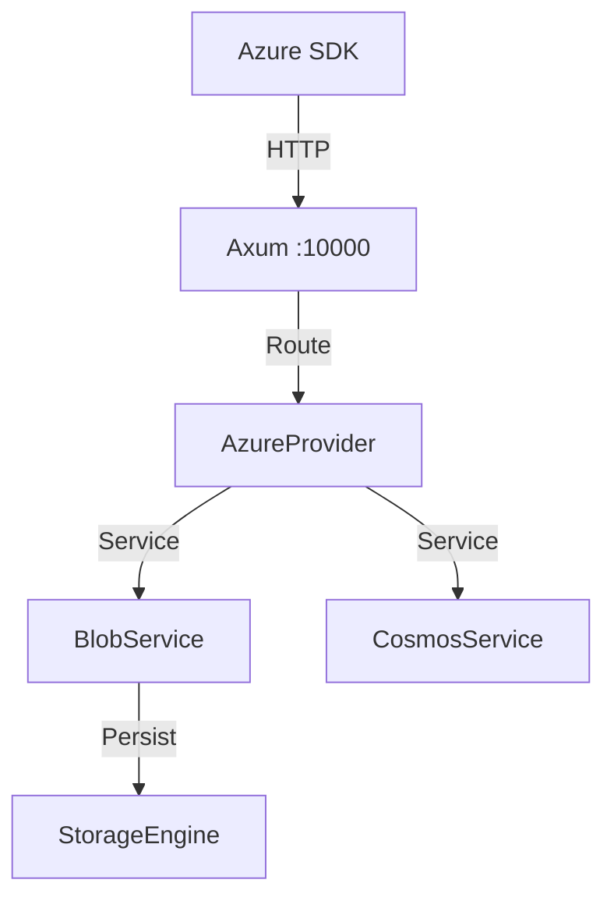

# Azure Module Architecture

## WHAT
Architecture of the Azure emulator.

## WHY
Independent Azure implementation sharing similar patterns to AWS for consistency.

## HOW

### Components
1. **Control Plane** (`azure-control-core`): Handles Azure REST/OData requests.
2. **Data Plane** (`azure-data-core`): Persists Blob Storage and Cosmos DB data.
3. **Facade**: Axum router for port 10000.

### Diagram

