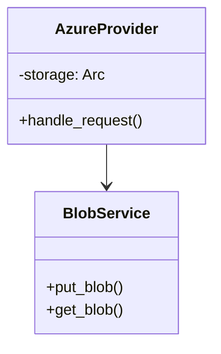

# Azure Class Diagrams

## WHAT
Structure of the Azure module code.

## WHY
Map out the Rust structs for Azure emulation.

## HOW

### Core Structures

```mermaid
classDiagram
    class AzureProvider {
        -storage: Arc<StorageEngine>
        +handle_request()
    }
    class BlobService {
        +put_blob()
        +get_blob()
    }
    AzureProvider --> BlobService
```
