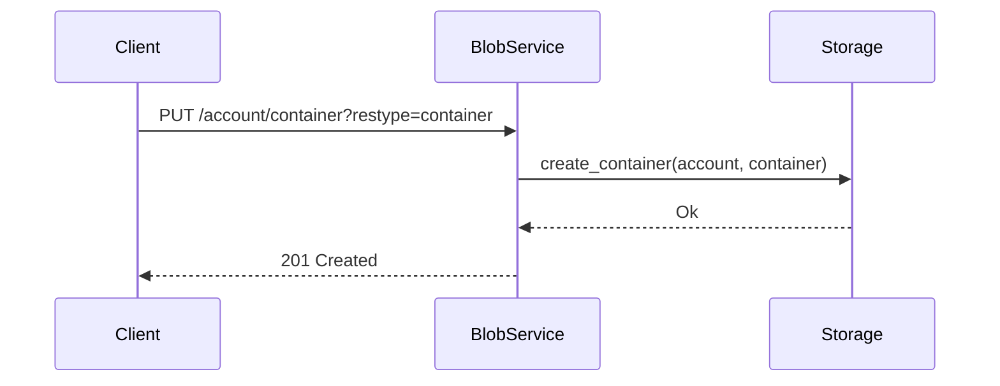

# Azure Sequence Diagrams

## WHAT
Sequence of interactions for Azure services.

## WHY
Understand internal calls for complex operations.

## HOW

### Create Container

```mermaid
sequenceDiagram
    participant Client
    participant BlobService
    participant Storage
    
    Client->>BlobService: PUT /account/container?restype=container
    BlobService->>Storage: create_container(account, container)
    Storage-->>BlobService: Ok
    BlobService-->>Client: 201 Created
```
