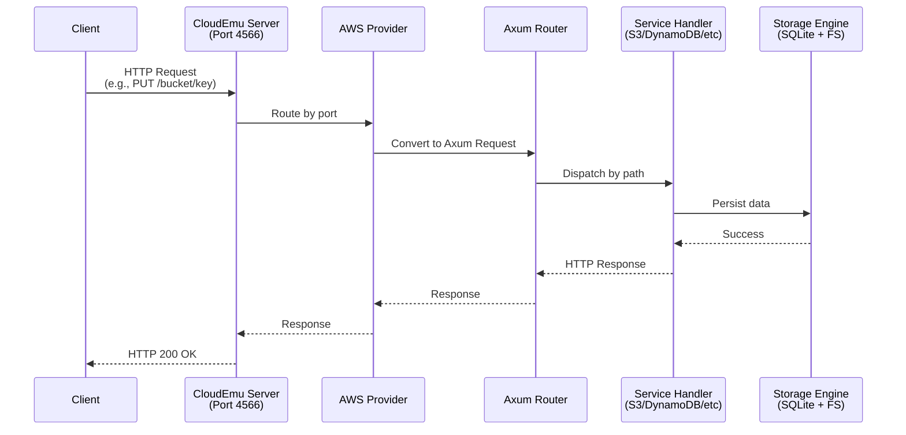
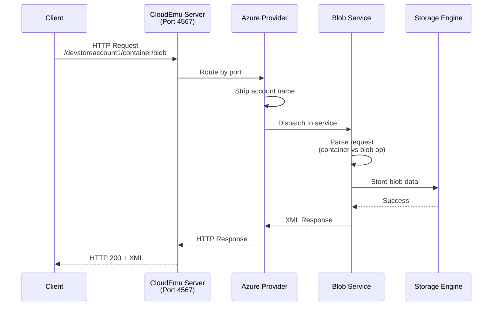
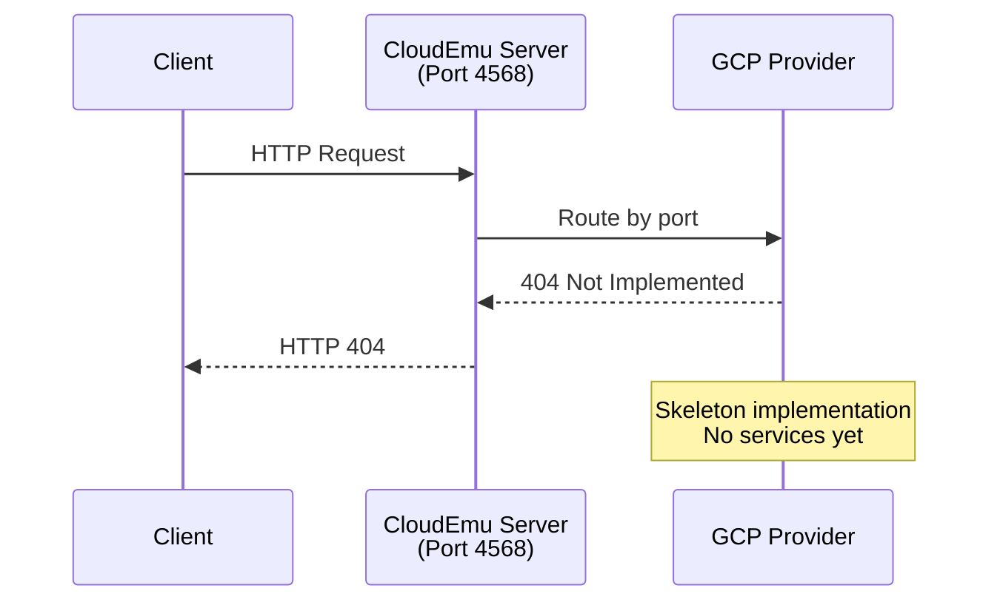
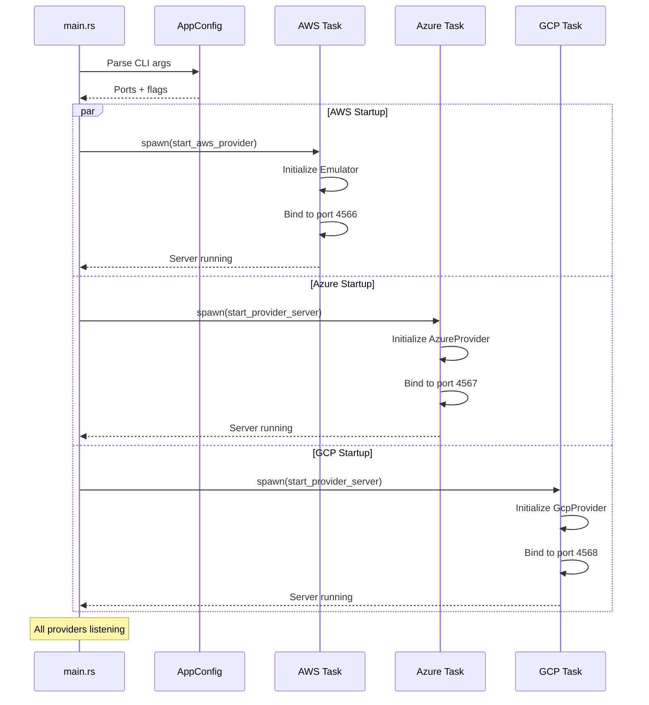
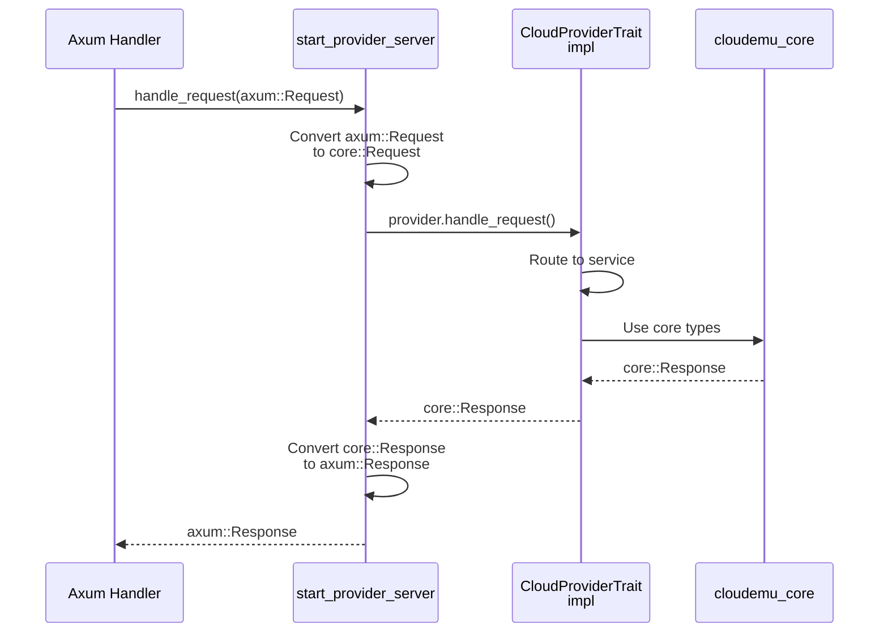
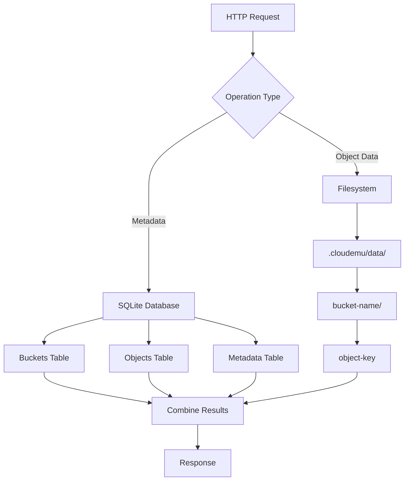
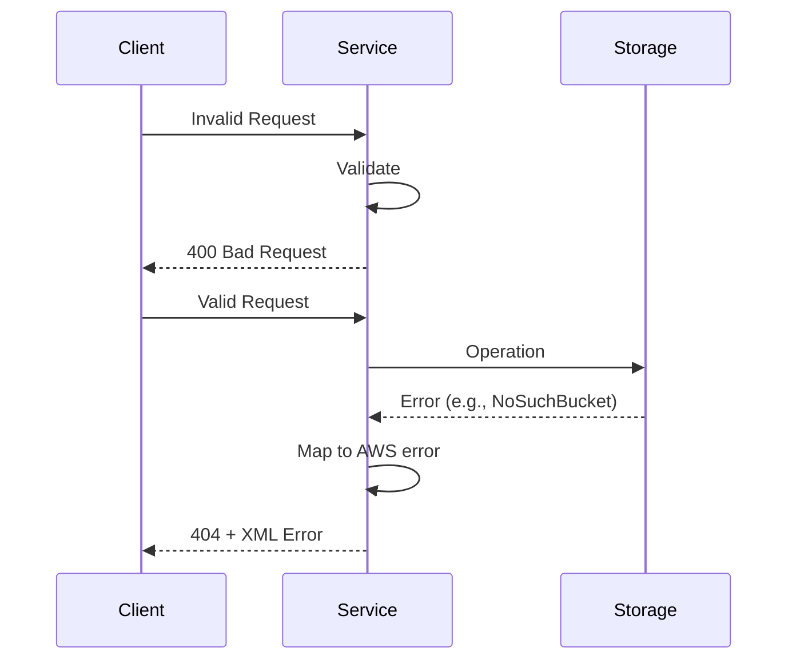

# Request Flow Diagrams

Visual representations of request flows through CloudEmu's multi-cloud architecture.

## AWS Request Flow

## Azure Request Flow

## GCP Request Flow (Skeleton)

## Multi-Cloud Server Startup

## Generic Provider Server Flow

## Storage Engine Data Flow

## Error Handling Flow

## Key Architectural Decisions

### Port-Based Routing

CloudEmu uses distinct ports to route requests to different cloud providers:
- **4566** → AWS (existing control-plane)
- **4567** → Azure (new generic server)
- **4568** → GCP (new generic server)

This allows clients to target specific clouds without request inspection.

### Two Server Patterns

1. **AWS**: Uses existing `control-plane::gateway::ingress::start()` for backward compatibility
2. **Azure/GCP**: Uses generic `server::start_provider_server()` with `CloudProviderTrait`

This hybrid approach maintains AWS compatibility while enabling new provider architectures.

### Request Conversion

The generic server converts between:
- `axum::Request` (HTTP layer)
- `cloudemu_core::Request` (provider layer)

This abstraction allows providers to be framework-agnostic.

---

**Last Updated**: 2026-01-14
