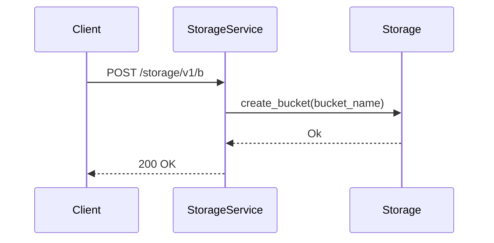

# GCP Sequence Diagrams

## WHAT
Sequence of interactions for GCP services.

## WHY
Understand internal calls for complex operations.

## HOW

### Create Bucket

```mermaid
sequenceDiagram
    participant Client
    participant StorageService
    participant Storage
    
    Client->>StorageService: POST /storage/v1/b
    StorageService->>Storage: create_bucket(bucket_name)
    Storage-->>StorageService: Ok
    StorageService-->>Client: 200 OK
```
