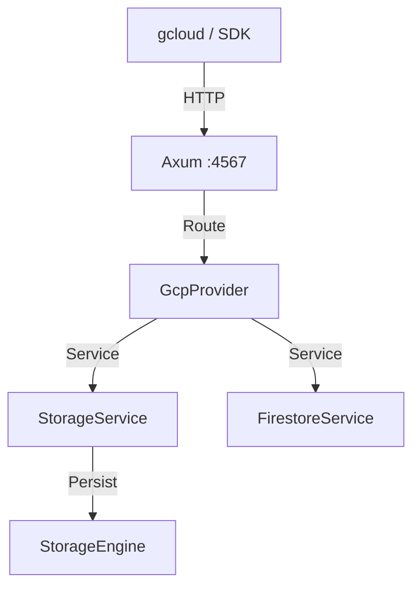

# GCP Module Architecture

## WHAT
Architecture of the GCP emulator.

## WHY
Supports Google Cloud APIs locally.

## HOW

### Components
1. **Control Plane** (`gcp-control-core`): Handles gRPC/REST requests.
2. **Data Plane** (`gcp-data-core`): Persists Cloud Storage and Firestore data.
3. **Facade**: Axum router for port 4567.

### Diagram

