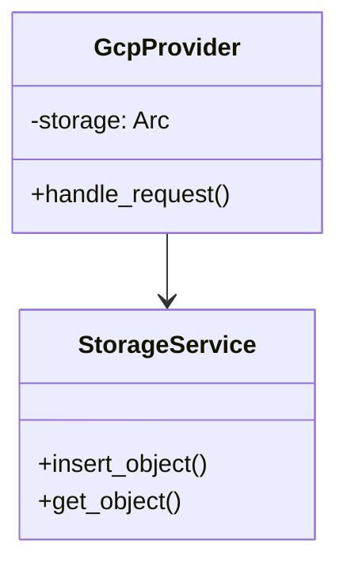

# GCP Class Diagrams

## WHAT
Structure of the GCP module code.

## WHY
Map out the Rust structs for GCP emulation.

## HOW

### Core Structures

```mermaid
classDiagram
    class GcpProvider {
        -storage: Arc<StorageEngine>
        +handle_request()
    }
    class StorageService {
        +insert_object()
        +get_object()
    }
    GcpProvider --> StorageService
```
