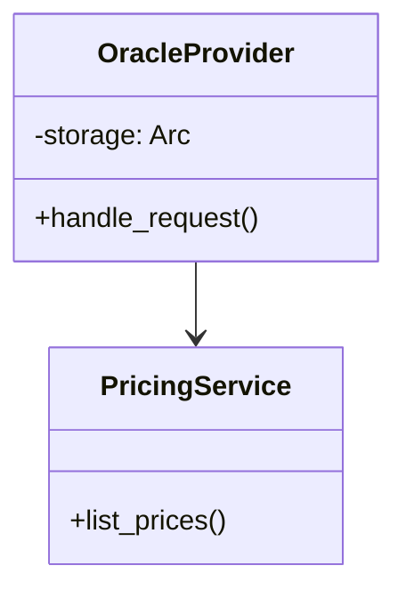

# Oracle Class Diagrams

## WHAT
Structure of the Oracle module code.

## WHY
Map out the Rust structs for Oracle emulation.

## HOW

### Core Structures

```mermaid
classDiagram
    class OracleProvider {
        -storage: Arc<StorageEngine>
        +handle_request()
    }
    class PricingService {
        +list_prices()
    }
    OracleProvider --> PricingService
```
