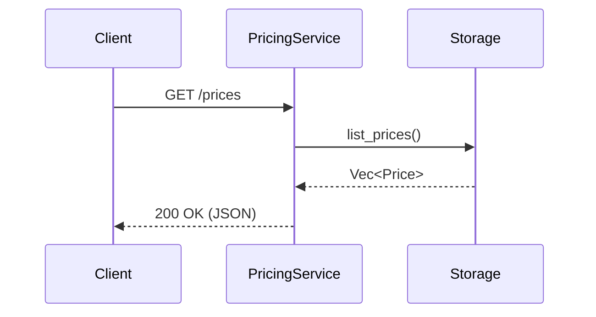

# Oracle Sequence Diagrams

## WHAT
Sequence of interactions for Oracle services.

## WHY
Understand internal calls.

## HOW

### Get Prices

```mermaid
sequenceDiagram
    participant Client
    participant PricingService
    participant Storage
    
    Client->>PricingService: GET /prices
    PricingService->>Storage: list_prices()
    Storage-->>PricingService: Vec<Price>
    PricingService-->>Client: 200 OK (JSON)
```
