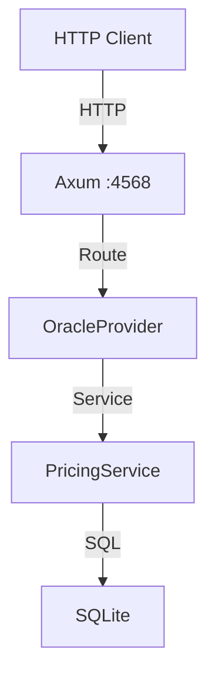

# Oracle Module Architecture

## WHAT
Architecture of the Oracle emulator (FinOps focus).

## WHY
Separate module for OCI specific logic.

## HOW

### Components
1. **Control Plane** (`oracle-control-core`): Handles OCI API requests.
2. **Data Plane** (`oracle-data-core`): Persists pricing data.
3. **Facade**: Axum router for port 4568.

### Diagram

