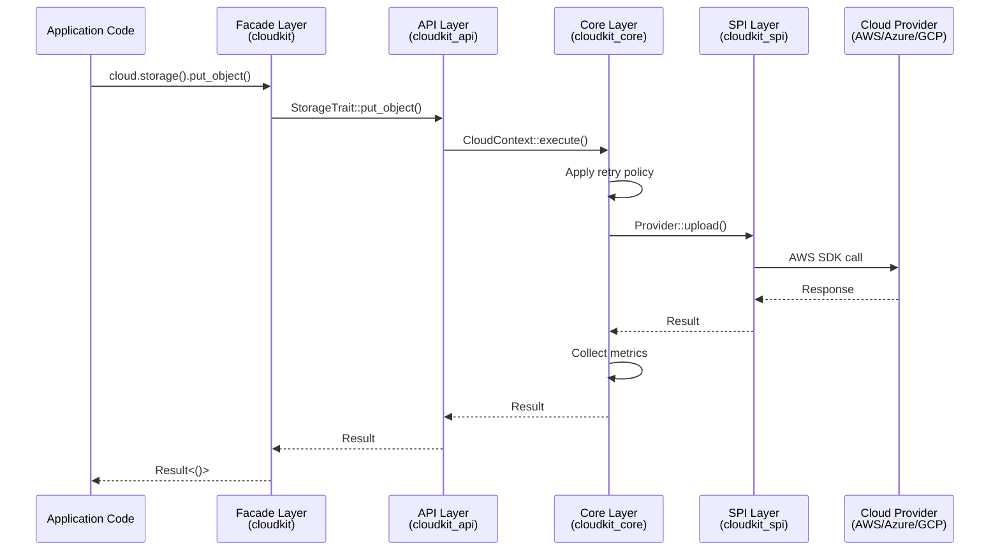
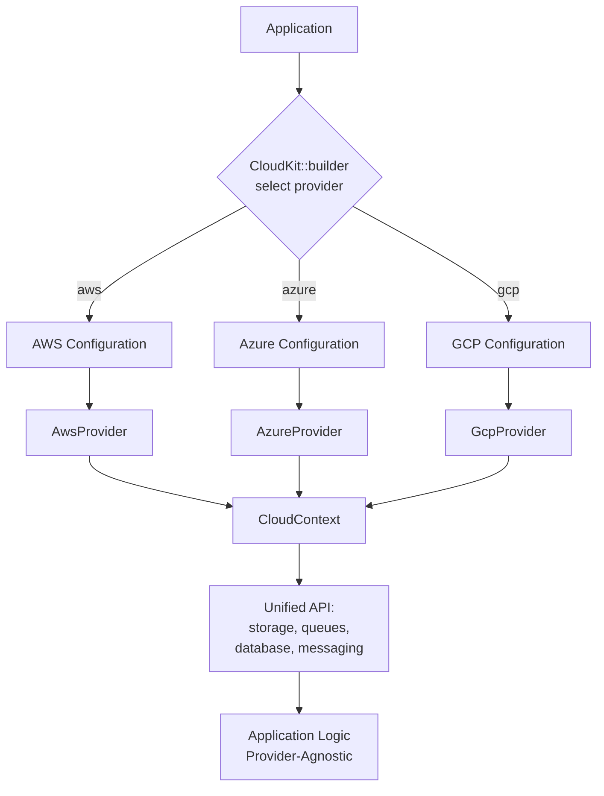
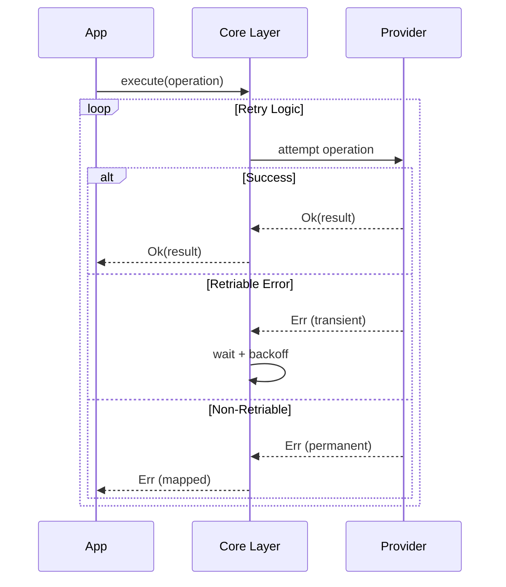
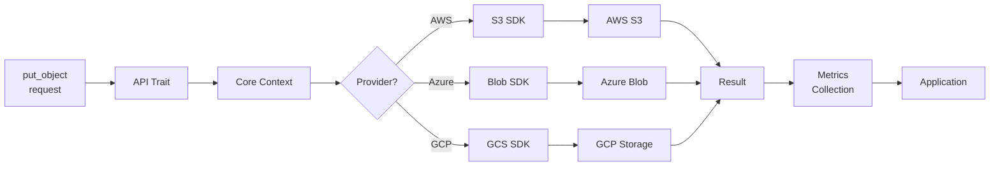
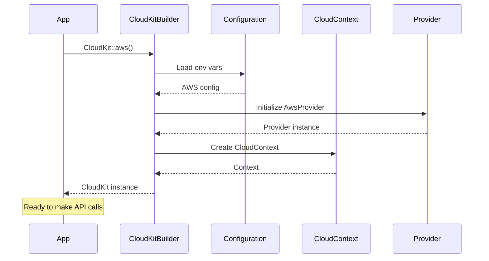
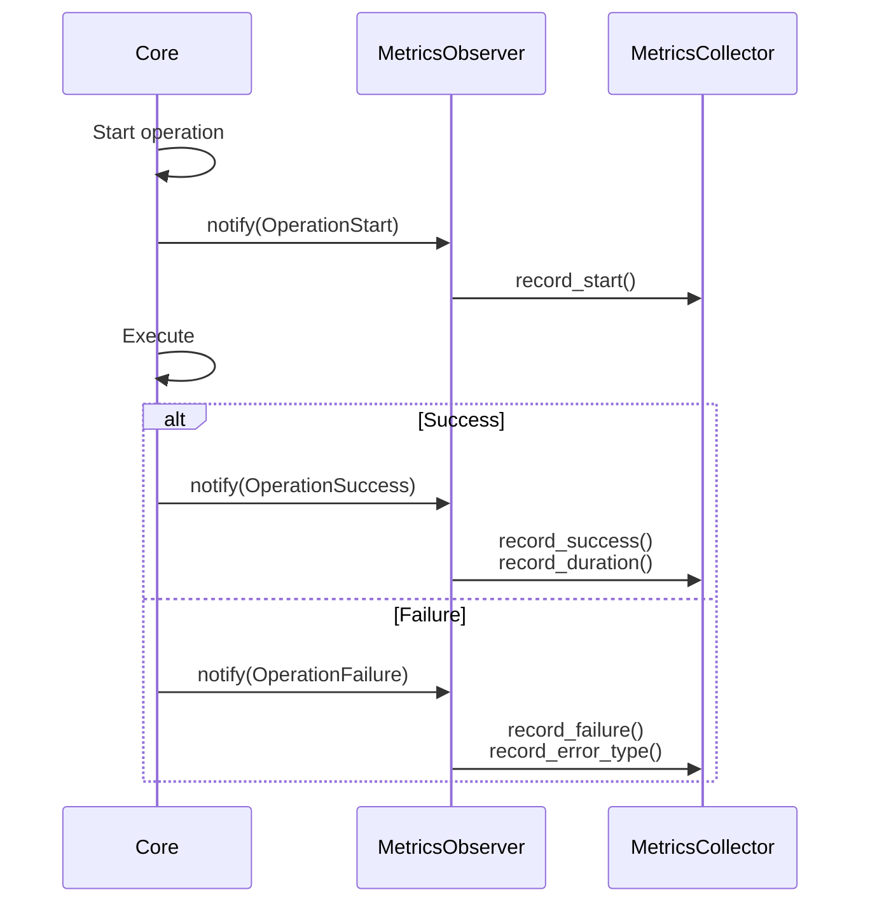
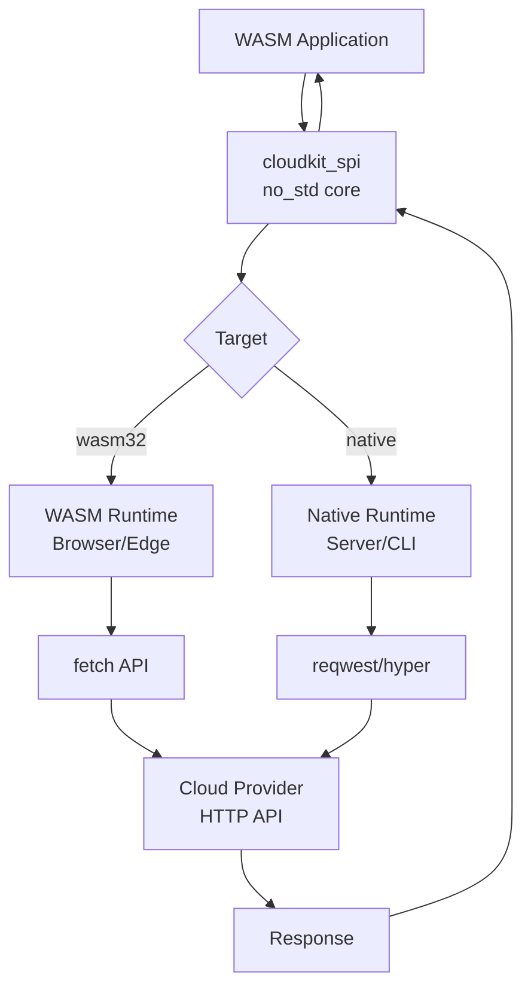
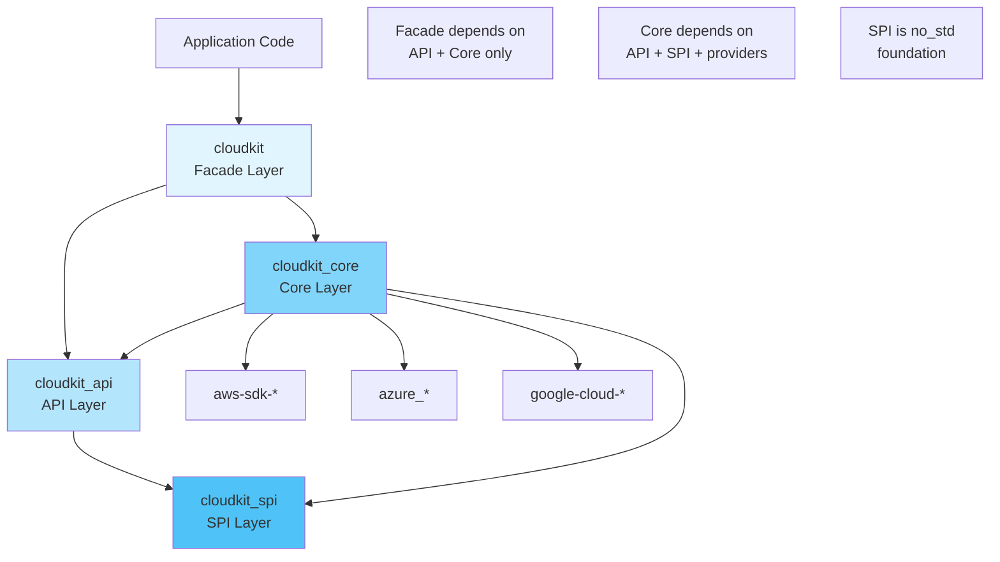
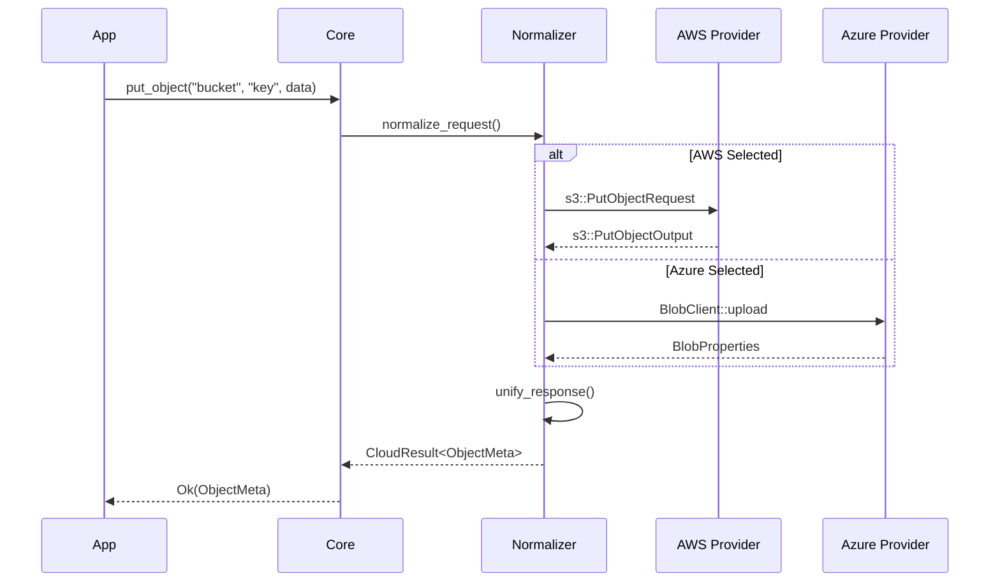

# SEA Layer Flow Diagrams

Visual representations of data flow through CloudKit's Stratified Encapsulation Architecture (SEA).

## Request Flow Through SEA Layers



## Multi-Cloud Provider Selection



## Retry and Error Handling



## Storage Operation Data Flow



## Configuration and Initialization



## Observer Pattern for Metrics



## WASM Compatibility Layer



## Dependency Flow (Layer Strictness)



## Cross-Cloud Request Normalization



## Key Architectural Principles

### 1. Unidirectional Dependency Flow

```
App → Facade → API → SPI
         ↓      ↓     ↑
       Core ────┘     │
         ↓            │
      Providers ──────┘
```

Upper layers never depend on lower implementation details.

### 2. Provider Isolation

Each provider (AWS, Azure, GCP) is:
- Implemented in Core layer
- Hidden from API consumers
- Swappable via configuration

### 3. No_std Foundation

`cloudkit_spi` is no_std compatible, enabling:
- WASM deployment
- Embedded systems
- Edge computing

### 4. Retry at Core

Retry logic centralized in Core layer ensures:
- Consistent behavior across providers
- Policy enforcement
- Metrics collection

---

**Last Updated**: 2026-01-14
