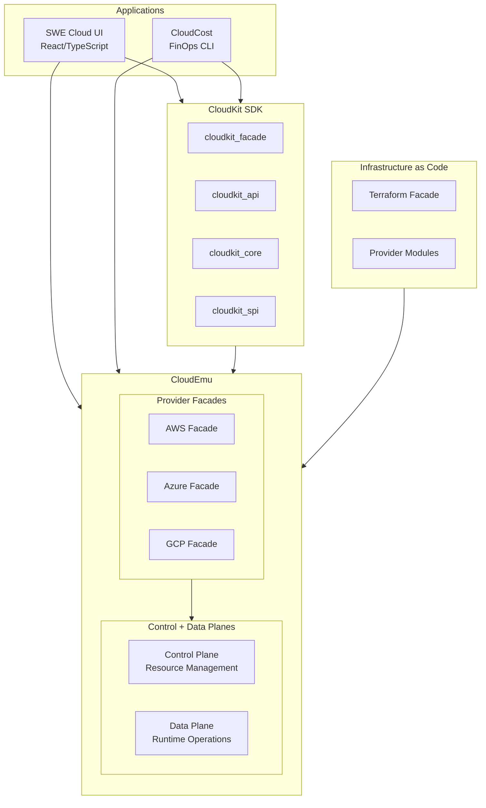

# SWE Cloud Architecture

**Audience**: Architects, Technical Leadership

## Overview

SWE Cloud follows a three-layer architecture with a shared SEA (SPI-API-Core-Facade) pattern across all Rust crates.

## High-Level Architecture



## SEA Layering Pattern

Every provider crate follows this dependency flow:

```
Facade → Core → API → SPI
```

- **SPI**: Types, errors, and foundational traits
- **API**: Public service trait contracts
- **Core**: Business logic and service implementations
- **Facade**: SAF re-exports providing a unified entry point

## Sub-Project Architecture
- [CloudEmu Architecture](../../cloudemu/docs/3-design/architecture.md)
- [CloudKit Architecture](../../cloudkit/docs/3-design/architecture.md)
- [IAC Architecture](../../iac/docs/3-design/ARCHITECTURE.md)
