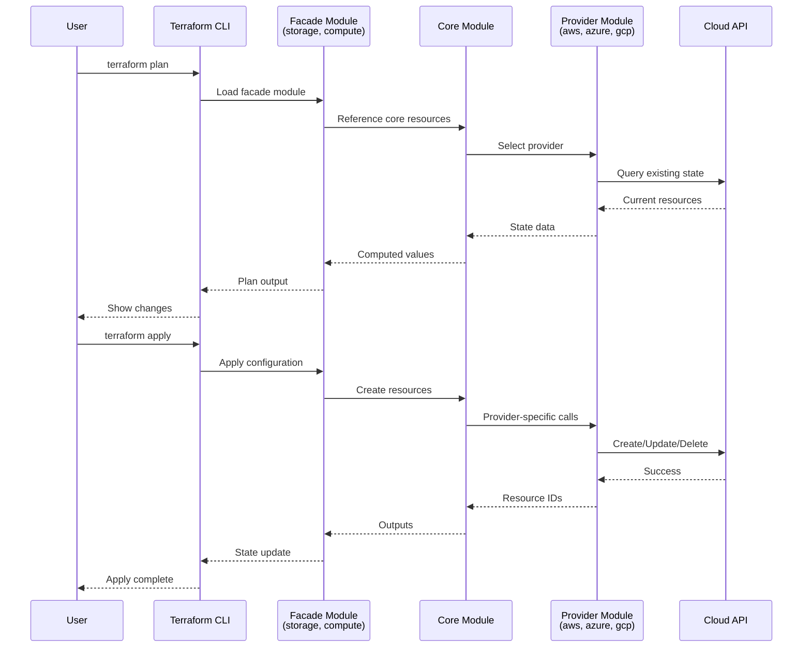
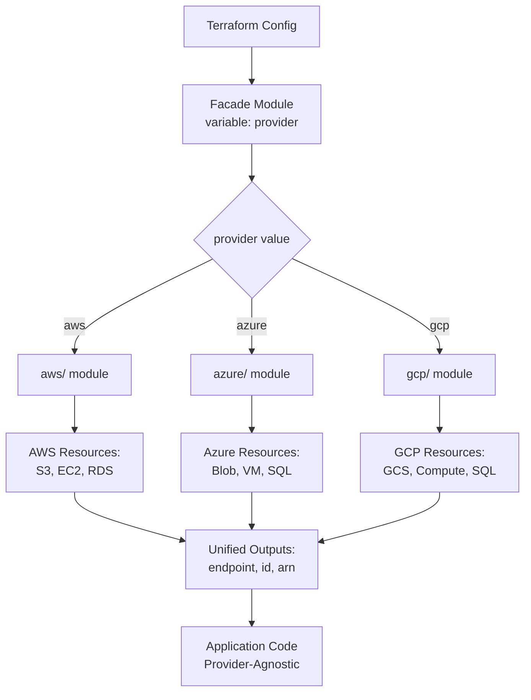
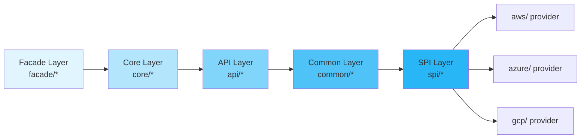
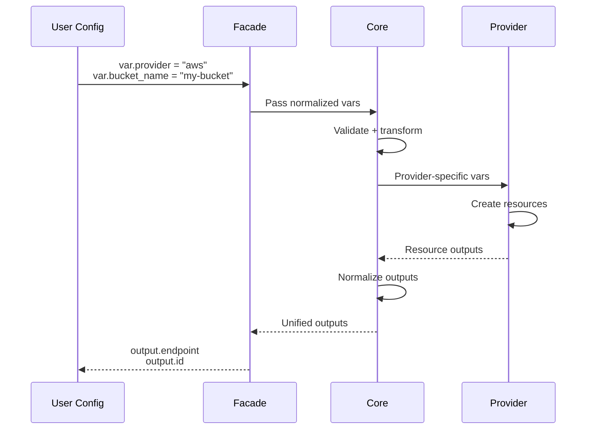
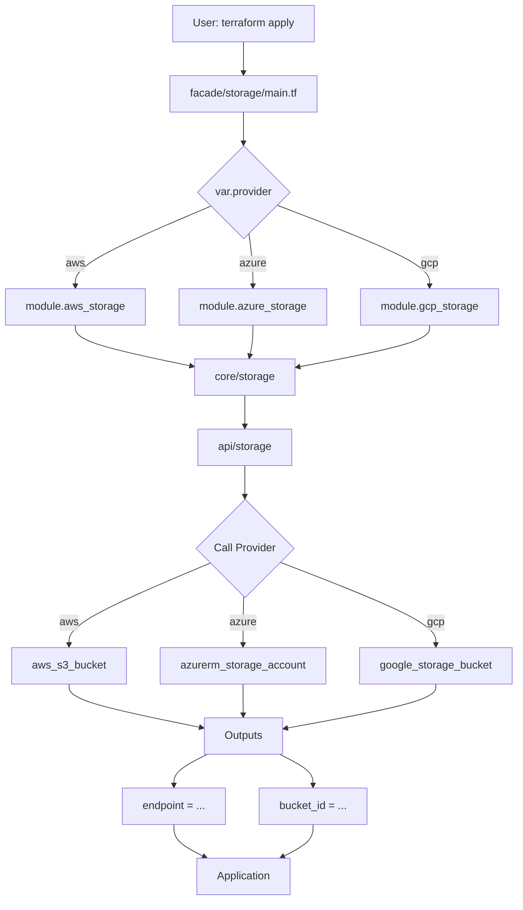
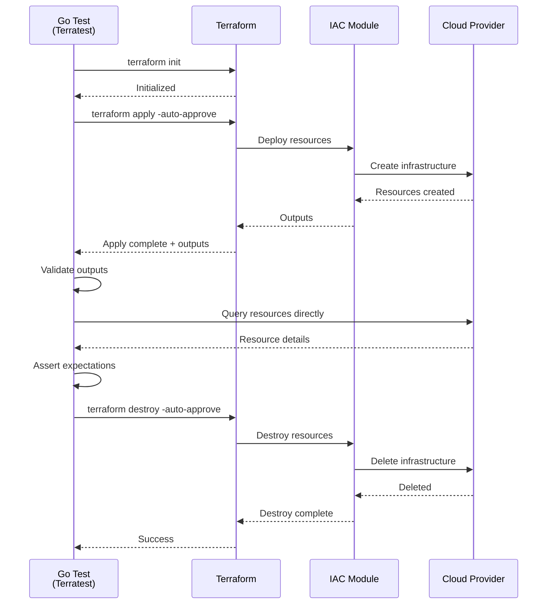
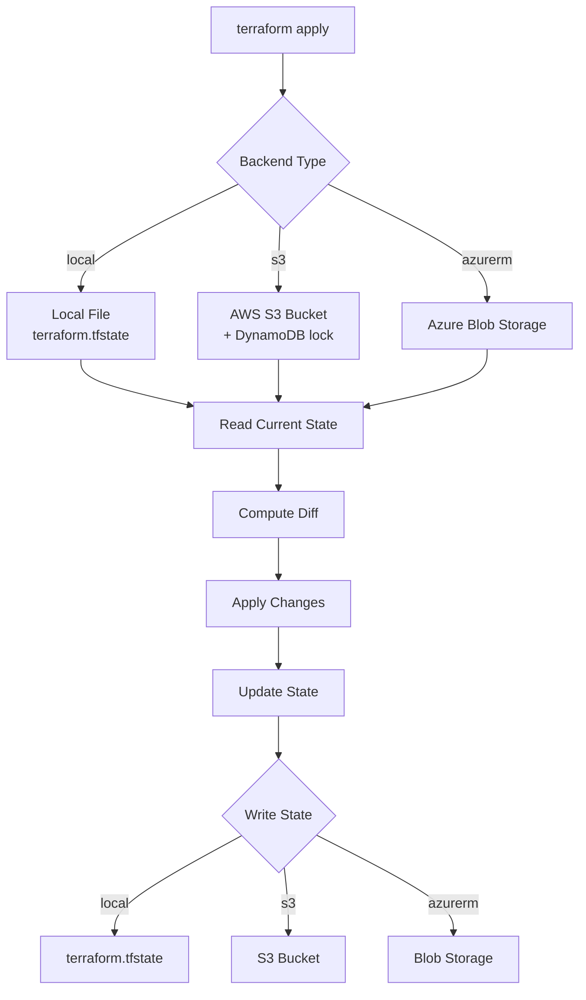
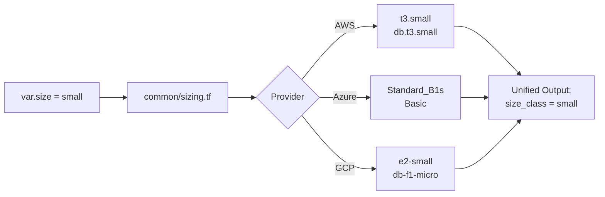
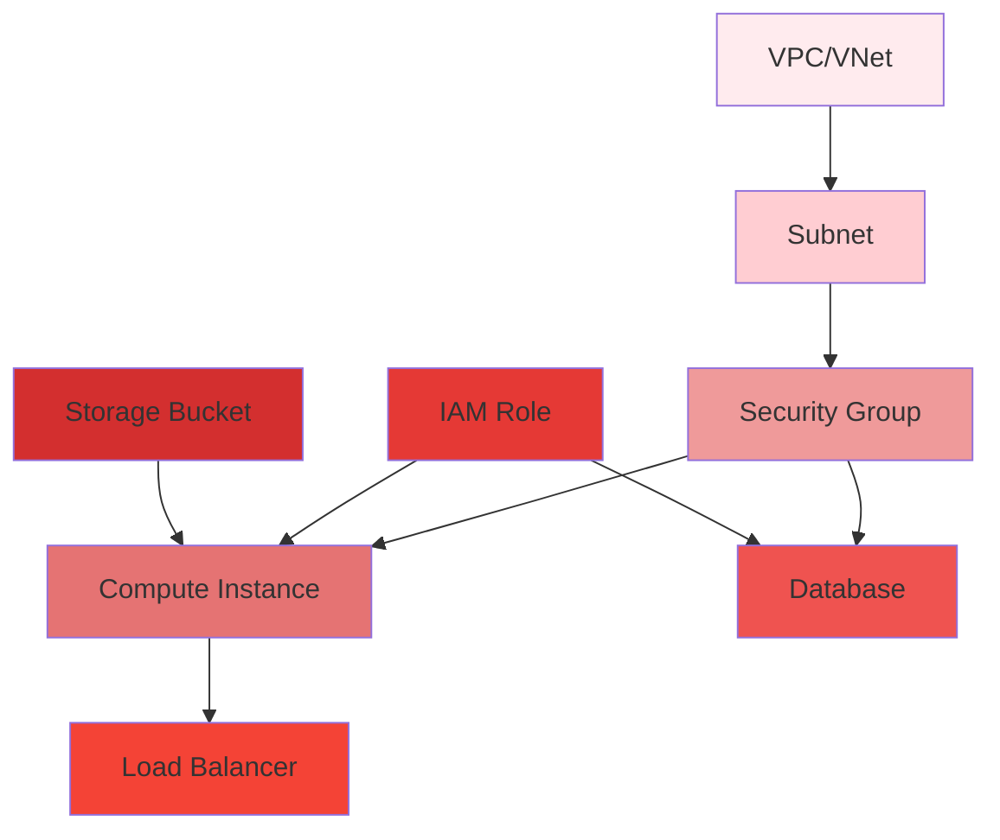
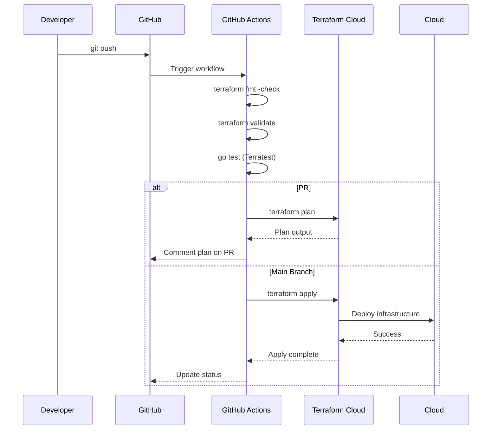

# Terraform Flow Diagrams

Visual representations of request flow through the IAC framework's SEA layers.

## Terraform Plan/Apply Flow



## Multi-Cloud Provider Selection



## SEA Layer Dependency Flow



## Variable and Output Flow



## Storage Facade Example



## Testing Flow with Terratest



## State Management Flow



## Size Normalization Pattern



## Dependency Graph Example



## CI/CD Integration



## Key Architectural Patterns

### 1. Provider Abstraction

Each facade module accepts a `provider` variable:
- **Input**: Unified parameters (size, environment, region)
- **Output**: Normalized attributes (endpoint, id, arn)
- **Implementation**: Provider-specific resources hidden

### 2. Module Composition

```
facade/storage
  ├── main.tf (entry)
  ├── core/
  │   └── Normalized logic
  └── providers/
      ├── aws/
      ├── azure/
      └── gcp/
```

### 3. State Isolation

- **Dev**: Local state
- **Staging**: S3 backend
- **Prod**: S3 backend + DynamoDB locking

### 4. Testing Pyramid

```
        E2E (Terraform Apply)
          ↑
       Integration (Go Tests)
          ↑
     Unit (Validation)
```

---

**Last Updated**: 2026-01-14
